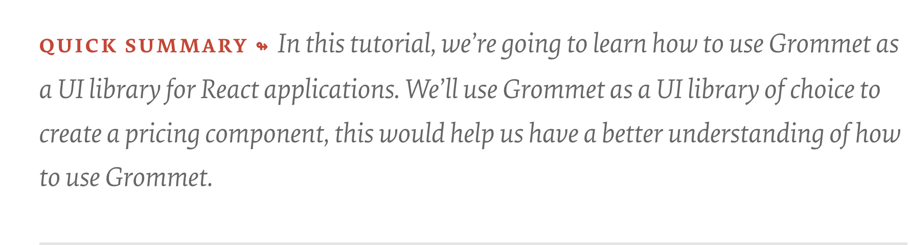
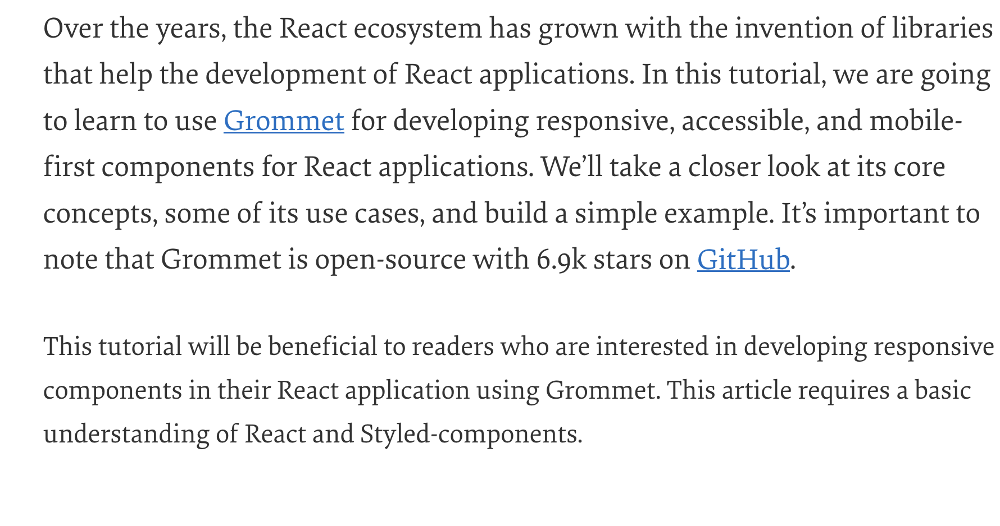
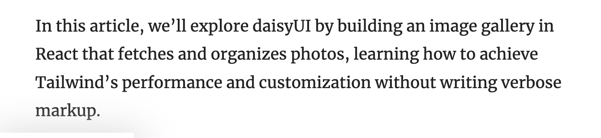
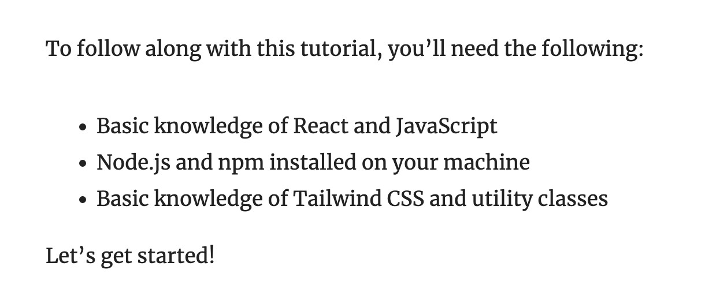
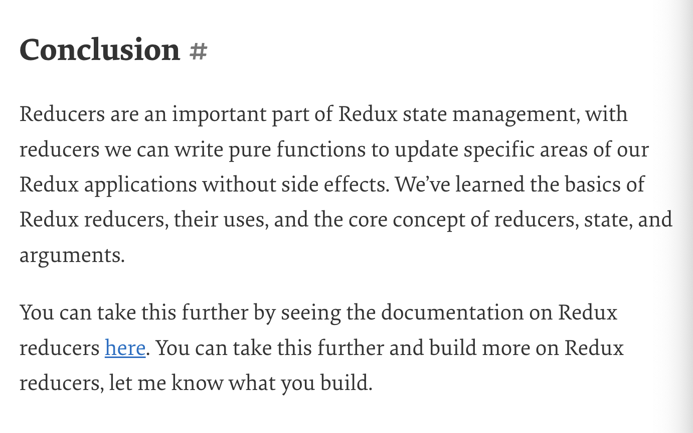
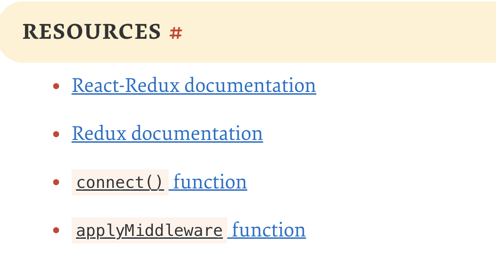

<div align="center">

#  Technical-Article-Guide-template
A template for writing technical articles and content for new and emerging technical writers 🥑 <br />

</div>

## Table of Contents

```
 ### Article Description 

 ### Article Title 

 ### Introduction 

 ### Prerequisites

 ### Article Body
 - Headings 
 - Subheadings
  
### Conclusion

### References and Resources
```

---

## Article Description

This is a description of your article, it should be a brief summary of what the article is about. It should be a few sentences long and should be written in the third person.

- Your description should explain what the article is about
- What problem does it solve for the reader
- what app you'd build in the article if there's any

Here's an example of an article description on using grommet in a react app:

> In this article, we will build a simple React app that uses Grommet, a React component library that provides accessibility, modularity, responsiveness, and theming in a tidy package. We will then deploy the app to Netlify.

Anther summary can be seen below:



## Article Title

An article title is the name you give your article. This is the first thing a reader sees when they come across your article - the TITLE. it should be catchy and describe your article. 

Example of a good title:

- Using React Hooks to Build a Simple Todo App
- How to deploy a React app to Netlify
- A deep dive into promises in JavaScript
- Getting started with Deno.js - a secure runtime for JavaScript and TypeScript

## Introduction

Your introduction is the genesis of your article. It's the first section of your article. It's also where you outline points about your article, goals and what the reader should expects, will learn and gain from reading your article.
You can make this section as long as you want, but it should be short and to the point.

Here is an example of an introductions from two of my articles:



Here's another introduction from another article 👇🏽




## Prerequisites

This section is where you list the things the reader should have before reading your article. Usually done in a bullet point or numbered lists, it could be a list of things like:  

- A software installed on their computer 
- A programming language they should know
- A framework they should know
- A library they should know
- Versions of software they should have installed
- Can even be a glass of wine 

Below is an example of a prerequisites section from one of my articles:



## Article Body

In this section, you'd start your article, however it's always advised that your article body should be broken down into sections and sub-sections. This makes it easier for the reader to follow and understand your article.
Usually most articles follow this structure:

- Heading 1 - What is the topic? what is the guide or technology about?

- Heading 2 - Why is the topic important? why should the reader care?
  
- Header 3 - How to do something? How to use the technology or guide?
  - subheading 1 - What is the first step?
  - subheading 2 - What is the second step? 
- Heading 4 - Conclusion - What did you learn? what did you build? what did you achieve?
  
- Heading 5 - References and Resources - Where did you get your information from? what are the resources you used?

Here's an example of an article body from one of my articles 
[Using DaisyUI: A Tailwind CSS component for React Apps](https://blog.logrocket.com/daisyui-tailwind-components-react-apps/)

```
- Introduction
- Prerequisites
- Generate a React App
- Install Dependencies
- Build a photo gallery application 
   - Intro Component
   - Building a navbar component
   - Build photo component
   - Fetching and organizing photos
- Conclusion
```

## Conclusion 

This section is where you'd summarize your article, its a little similar to the article description, however two to three sentences more lengthier. You can also add a link to an external resource here such as a github link to your application but that's optional. 

[Here's an example of a conclusion from my article on how redux reducers work ](https://www.smashingmagazine.com/2020/12/how-redux-reducers-work/)



## References and Resources

This section is where you'd list the resources you used to write your article. It could be a website a blog post, a tweet, a github repo, a medium article, or a github repo. It can also be credits to other blog posts for the reader to read more. 

You can check out the reference section of my article on how redux reducers work [here](https://www.smashingmagazine.com/2020/12/how-redux-reducers-work/#resources)

